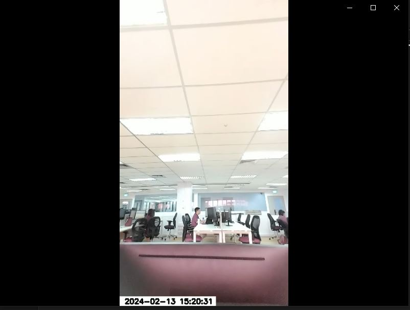

# Webcam Recorder

This Python script records video from a webcam and saves it to a file. The recording is done within a specified time range.

## Requirements

- Python 3
- OpenCV (cv2)

## Usage

1. Set the `output_dir` variable to the directory where you want to save the video file.

```python
output_dir = r'C:\path\to\your\output\folder'
```

2. Set the start_time and end_time variables to the time range during which you want to record video.

```python
start_time = time(7, 00)  
end_time = time(8, 00)  
```

3. Run the script.
``` python
webcam_record.py
```

This script performs the following steps:

1. Opens the webcam and checks if it is working correctly.
2. Defines the codec and creates a VideoWriter object.
3. Creates a window to display the video feed.
4. In a loop, it captures frames from the webcam, rotates them, adds a timestamp, and checks if the current time is within the specified range. If it is, it writes the frame to the video file.
5. The loop continues until the 'q' key is pressed.
6. Finally, it releases the capture, the writer, and destroys the window.
 
The output is a video file in the specified directory, with the video recorded from the webcam during the specified time range.


Output:


